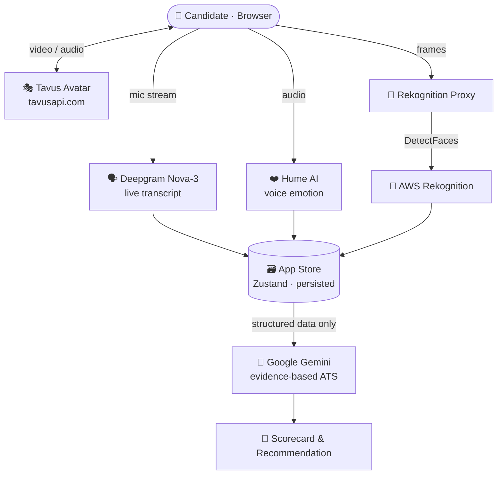

<div align="center">

# 🎙️ TalbotIQ — AI Video Interview Platform

### Conversational AI avatar interviews with real‑time sentiment, speech, and facial analysis

*Run lifelike video interviews driven by a Tavus avatar, then score candidates with an evidence‑based AI panel that fuses **what they said**, **how they said it**, and **how they looked saying it**.*

[](https://react.dev)
[](https://www.typescriptlang.org)
[](https://vitejs.dev)
[](https://tailwindcss.com)
[](https://www.tavus.io)
[](https://aws.amazon.com/rekognition/)

</div>

---

## ✨ Overview

**TalbotIQ** is a multi‑provider interview platform that combines a **conversational AI video avatar** with a **multi‑modal scoring engine**. A candidate talks to a photoreal Tavus replica in the browser; in parallel the platform captures and analyses the conversation across four independent signals, then a reasoning layer (Gemini) turns those signals into a transparent, evidence‑based scorecard.

| Signal | Provider | What it measures |
|--------|----------|------------------|
| 🗣️ **Speech** | [Deepgram](https://deepgram.com) (Nova‑3) | Live transcription, words‑per‑minute, filler words |
| ❤️ **Voice emotion** | [Hume AI](https://hume.ai) | Prosody & sentiment across the conversation |
| 🙂 **Facial signal** | [AWS Rekognition](https://aws.amazon.com/rekognition/) | Per‑question facial expression / engagement |
| 🧠 **Reasoning / ATS** | [Google Gemini](https://ai.google.dev) | Evidence‑based, structured candidate assessment |
| 🎭 **Avatar** | [Tavus](https://www.tavus.io) | Real‑time conversational video interviewer |

> 🔐 **Accuracy first.** Gemini never receives raw audio and never re‑transcribes — it reasons only over clean, already‑verified structured data (Deepgram transcript + Hume prosody + Rekognition facial summary) and returns a structured, evidence‑graded result.

---

## 🚀 Key Features

- 🎬 **Live avatar interviews** — configure and launch a Tavus conversation with full control over replica, persona, and conversational layers (LLM, TTS, STT, perception, VQA).
- 📝 **Real‑time transcription** — Deepgram Nova‑3 streams the candidate's speech with filler‑word and pace metrics.
- 📈 **Emotion analytics** — Hume‑powered timelines, radars, heatmaps, per‑question emotion summaries, and a composite sentiment score.
- 👀 **Facial analysis** — optional AWS Rekognition `DetectFaces` per question, served through a secure proxy (keys never touch the browser).
- 🧾 **AI scorecard** — Gemini produces a dimensioned, evidence‑level‑tagged assessment with a hiring recommendation.
- 🗂️ **Full Tavus management** — CRUD for replicas (with training progress) and personas.
- 📊 **Analytics dashboard** — charts, filters, and bulk actions across sessions.
- 💾 **Persisted state & exports** — Zustand‑backed store, auto‑polling via React Query, exportable results.

---

## 🧭 Pages

| Page | Route | Description |
|------|-------|-------------|
| **Setup** | `/setup` | Tavus conversation configurator with a live JSON preview |
| **Interview** | `/interview` | Tavus video iframe + live AI sidebar, overrides, fullscreen |
| **Results** | `/results` | Scorecard, emotion timeline, AI recommendation, export |
| **Replicas** | `/replicas` | Replica CRUD, training progress, video preview |
| **Personas** | `/personas` | All persona layers: LLM, TTS, STT, Perception, VQA |
| **Analytics** | `/analytics` | Charts, filters, bulk actions |
| **Settings** | `/settings` | API keys, webhooks, multi‑tenant options |

---

## 🏗️ Architecture



**Why a proxy for AWS?** The browser cannot call Rekognition directly without exposing a long‑lived secret, and AWS blocks cross‑origin browser calls. A tiny server‑side proxy holds the credentials:

- **Local dev** → `talbotiq-platform/rekognition-proxy-local/` (Express, `http://localhost:3002`)
- **Production** → `talbotiq-platform/lambda/rekognition-proxy/` (AWS Lambda, Node 20.x, credentials from the execution **role** — *no keys in code or browser*)

---

## 🧱 Tech Stack

- **Frontend:** React 18 · TypeScript 5 · Vite 5
- **Styling:** Tailwind CSS (TalbotIQ dark theme)
- **Routing:** React Router v6
- **State:** Zustand (persisted)
- **Data fetching:** TanStack React Query (auto‑polling)
- **Charts:** Recharts
- **UX:** react‑hot‑toast · lucide‑react icons
- **Video:** `@daily-co/daily-js` (Tavus transport)
- **Backend (facial):** Node.js / Express (dev) + AWS Lambda (prod) · `@aws-sdk/client-rekognition`

---

## 📦 Project Structure

```
.
├── talbotiq-platform/              # Main React + TS + Vite application
│   ├── src/
│   │   ├── pages/                  # Setup, Interview, Results, Replicas, Personas, Analytics, Settings
│   │   ├── components/             # ui · layout · hume · ats
│   │   ├── services/               # tavus · deepgram · hume · geminiAnalysis · rekognitionService · ...
│   │   ├── hooks/                  # useTavus · useDeepgramTranscript · useHumeStream · useGeminiAnalysis · ...
│   │   ├── store/                  # useAppStore (Zustand)
│   │   └── types/
│   ├── lambda/rekognition-proxy/   # AWS Lambda for production facial analysis
│   ├── rekognition-proxy-local/    # Local Express proxy for dev facial analysis
│   ├── public/
│   ├── .env.example                # Copy to .env.local and fill in your keys
│   └── package.json
├── talbotiq-tavus.html             # Standalone single-file prototype
├── serve.ps1                       # Tiny static server for the prototype
└── .gitignore
```

---

## 🏁 Getting Started

### Prerequisites
- [Node.js](https://nodejs.org/en/download) **LTS** (18+) and npm
- API keys for the providers you want to enable (see [Configuration](#-configuration))

### 1. Install dependencies
```bash
cd talbotiq-platform
npm install
```

### 2. Configure environment
```bash
cp .env.example .env.local   # Windows PowerShell: Copy-Item .env.example .env.local
```
Then edit `.env.local` and add your keys (see below). `.env.local` is **git‑ignored** and never committed.

### 3. Run the dev server
```bash
npm run dev
```
The app starts at **http://localhost:3001**.

### 4. (Optional) Enable facial analysis
In a second terminal:
```powershell
cd talbotiq-platform/rekognition-proxy-local
npm install
# set your AWS credentials, then:
.\start.ps1        # serves http://localhost:3002/analyze-face
```
See [`rekognition-proxy-local/README.md`](talbotiq-platform/rekognition-proxy-local/README.md) for details and the production Lambda path.

---

## 🔧 Configuration

`talbotiq-platform/.env.local` (template in [`.env.example`](talbotiq-platform/.env.example)):

| Variable | Purpose | Required |
|----------|---------|----------|
| `VITE_DEEPGRAM_KEY` | Deepgram transcription key | for live transcript |
| `VITE_HUME_KEY` | Hume AI emotion key | for sentiment analytics |
| `VITE_GEMINI_KEY` | Google Gemini key | for the AI scorecard |
| `VITE_REKOGNITION_PROXY_URL` | Facial‑analysis proxy URL (default `http://localhost:3002/analyze-face`) | for facial analysis |

> 🎭 The **Tavus API key** and **AWS credentials** are entered in the **Settings** page (stored locally), not in `.env.local`. AWS keys for the proxy are supplied via environment variables when launching the proxy / Lambda role.

### 📜 npm scripts (`talbotiq-platform/`)
| Script | Action |
|--------|--------|
| `npm run dev` | Start Vite dev server (`:3001`) |
| `npm run build` | Type‑check + production build |
| `npm run preview` | Preview the production build |
| `npm run lint` | ESLint (TS/TSX) |

---

## 🔒 Security

- **No secrets in the repo.** `.env.local` is git‑ignored; only `.env.example` placeholders are committed. The production facial proxy uses an AWS **execution role**, so no access keys live in code or the browser.
- **Rotate exposed keys.** If any API key was ever committed or shared, revoke and reissue it — removing a key from source does not un‑expose it.
- **Lock down CORS** on the Lambda Function URL (it ships with `*` for convenience) before going to production.

---

## 📝 Disclaimer

This project integrates third‑party AI services (Tavus, Deepgram, Hume, Google Gemini, AWS Rekognition), each with its own pricing, terms, and data‑handling policies. When analysing people, ensure you have appropriate **consent** and comply with applicable privacy and employment regulations. Automated assessments should support — not replace — human decision‑making.
